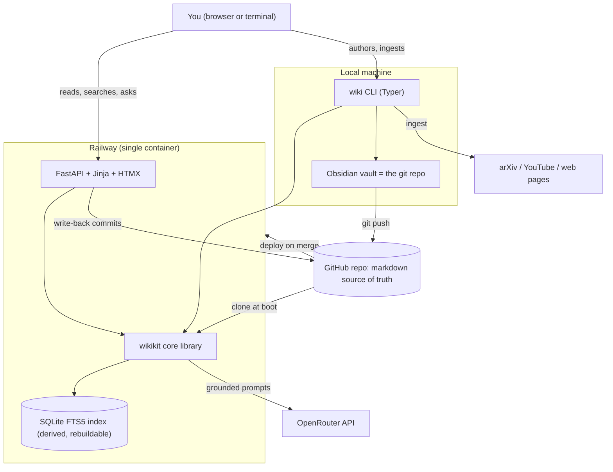
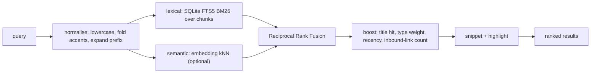
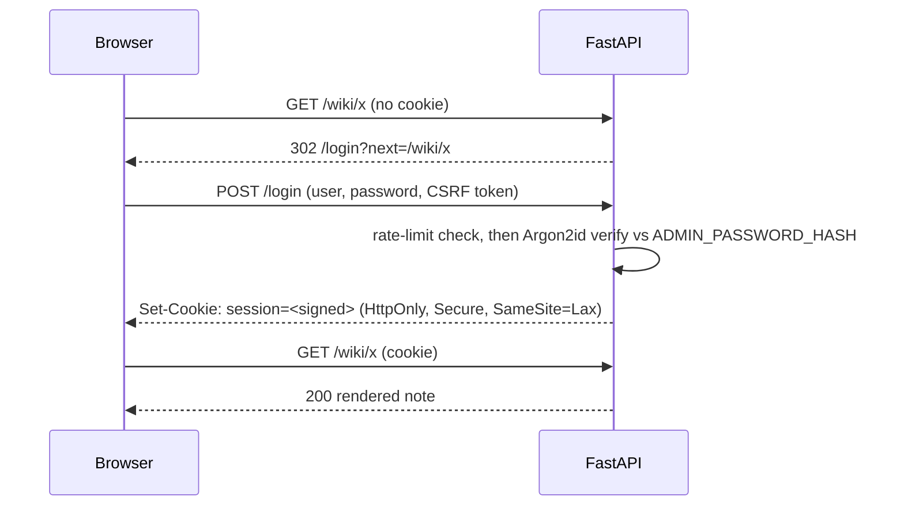
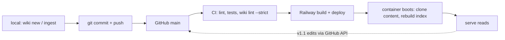

# 03 — Target Architecture

**Status:** for review · **Depends on:** `docs/01-functional-requirements.md`, `docs/02-non-functional-requirements.md`

This document describes the system we are proposing to build, and — just as importantly — the
alternatives that were considered and rejected. Nothing here is built yet.

---

## 1. Guiding principles

1. **Markdown in git is the only source of truth.** Every index, cache, and database is derived and
   disposable. If Railway vanishes tomorrow, `git clone` gives you your entire knowledge base, and
   Obsidian opens it unchanged. This is the principle that most "let's put it in a real database"
   redesigns get wrong.
2. **The wiki must remain a valid Obsidian vault.** Wikilinks, frontmatter, Dataview, graph view. The
   web app is an *additional* reader, not a replacement.
3. **One core library, thin adapters.** The CLI and the web app are two faces of the same
   `wikikit` package. Today's monolith cannot be imported by a web app (F-26), which is why this
   matters.
4. **The quality gate is executable.** Conventions that only exist in prose drift (F-12). Every rule
   in `AGENTS.md` gets a lint rule with an ID and a test.
5. **Boring, cheap infrastructure.** One container, one process, no managed database for v1. Every
   piece of infrastructure has to justify its monthly bill and its failure modes.
6. **Human stays the curator.** The LLM drafts; you promote. AI-authored pages are marked `draft`
   until reviewed, which is also our prompt-injection containment strategy (F-24).

---

## 2. System context



The important shape: **content flows through git**, not through a database. The container is stateless
and rebuilds its index at boot from the cloned markdown.

---

## 3. Identity and naming — fixing the "long numbers" problem

The current scheme puts a 14-digit timestamp in the filename, which then appears in every link and
every URL (F-06). The fix separates three concepts that were conflated:

| Concept | Purpose | Example | Mutable? |
| --- | --- | --- | --- |
| **UID** | Immutable identity, ordering, and collision-free references | `20260810100100` | Never |
| **Slug** | Filename, URL, and what you type in a link | `scaled-dot-product-attention` | Yes, with alias |
| **Title** | Human display text | `Scaled Dot-Product Attention` | Yes, freely |

So the file becomes:

```
wiki/atomic/scaled-dot-product-attention.md
```

```yaml
---
uid: "20260810100100"          # unchanged forever, survives every rename
title: "Scaled Dot-Product Attention"
type: zettel
created: 2026-08-10
updated: 2026-08-10
status: stable
tags: [attention, transformer, math]
aliases:
  - "20260810100100-scaled-dot-product-attention"   # the old link target, still resolves
  - "scaled dot product attention"
sources:
  - "sources/pdfs/attention-is-all-you-need-paper.md"
---
```

And links become readable:

```markdown
- [[scaled-dot-product-attention]] — the operator this note parallelises across heads
```

### Link resolution order

`wikikit.links.resolve(target)` tries, in order, and reports ambiguity rather than guessing (F-05, F-09):

1. exact slug match
2. exact `aliases` match
3. exact `uid` match (so `[[20260810100100]]` works forever)
4. case-insensitive title match
5. case-insensitive slugified-title match
6. → unresolved: rendered with broken-link styling, reported by lint rule `W003`

Two candidates at the same precedence level is an error (`W012`), never a coin flip. This is what
makes "you can rename anything, any time" a safe promise rather than a hope.

### Why keep the UID at all?

Because it is free, it is immutable, and it gives you three things slugs cannot: chronological
ordering of when a thought entered the system, a stable reference for external tools, and a guaranteed
unique fallback slug (`zettel-20260810100100`) when a title transliterates to nothing (F-08). It just
does not belong in the filename, where you have to look at it every day.

---

## 4. Content model

### Layers (unchanged from `AGENTS.md`, now enforced)

| Layer | Directory | `type` | Written by | Rule |
| --- | --- | --- | --- | --- |
| Raw sources | `sources/{youtube,web,pdfs,documents,assets}/` | `*_source` | ingest tools | immutable |
| Literature notes | `wiki/sources/` | `literature` | LLM, human-reviewed | one per raw source |
| Atomic zettels | `wiki/atomic/` | `zettel` | LLM + human | one idea, < 250 lines, ≥ 1 inbound MOC link |
| Concepts | `wiki/concepts/` | `concept` | LLM + human | topic overview linking zettels |
| Entities | `wiki/entities/` | `entity` | LLM + human | org, model, framework, benchmark |
| MOCs / syntheses | `wiki/syntheses/` | `moc`, `synthesis` | LLM + human | structural hubs |
| Meta | `wiki/index.md`, `wiki/log.md` | `moc`, `log` | tooling | generated, schema-valid (fixes F-12) |

### Frontmatter schema

Formalised as a Pydantic model, so validation, the lint rules, and the API response types come from
one definition:

| Field | Required | Type | Notes |
| --- | --- | --- | --- |
| `uid` | yes | string, 14 digits | immutable, unique across the wiki (`W011`) |
| `title` | yes | string | display text |
| `type` | yes | enum | `zettel \| literature \| moc \| concept \| entity \| synthesis \| source \| log` |
| `created` | yes | date | |
| `updated` | yes | date | maintained by tooling on write |
| `tags` | yes | list[str] | lowercase, hyphenated |
| `sources` | conditional | list[path] | required for `literature` and `zettel` (`W021`) |
| `aliases` | no | list[str] | populated automatically on rename |
| `status` | no | enum | `draft \| review \| stable`, default `stable`; LLM output starts `draft` |
| `generated_by` | no | string | model slug when machine-authored |

`sources/` files keep a looser schema (`url`, `retrieved_at`, `content_sha256`, plus per-kind fields)
because they are archival records, not wiki pages.

### The edge model — link rationales are data

`AGENTS.md` already requires a justification after each link (F-13). We parse it and treat it as the
edge label, which is what makes the graph *readable* instead of a hairball:

```markdown
- [[cross-encoder-reranking]] — applied after vector search to improve precision
```

```json
{ "from": "retrieval-augmented-generation",
  "to": "cross-encoder-reranking",
  "rationale": "applied after vector search to improve precision",
  "context": "list-item",
  "line": 42 }
```

---

## 5. Target repository layout

```
.
├── AGENTS.md                    # schema for LLM agents (kept authoritative, CI-checked)
├── README.md                    # setup, usage, architecture
├── LICENSE
├── pyproject.toml               # packaging, deps, ruff/mypy/pytest config, `wiki` entry point
├── uv.lock                      # pinned, committed
├── Dockerfile
├── railway.json               # config-as-code: builder, health check, restart policy
├── docs/                        # this plan, plus ADRs
│   └── adr/
├── src/
│   └── wikikit/
│       ├── config.py            # env-driven settings, validated at import
│       ├── models.py            # Pydantic frontmatter + Note/Edge/Finding types
│       ├── notes.py             # read/write/parse markdown, atomic writes, slug generation
│       ├── links.py             # wikilink parsing, resolution, rationale extraction
│       ├── graph.py             # graph build, backlinks, metrics, mermaid export
│       ├── index/
│       │   ├── store.py         # SQLite FTS5 schema + incremental upsert
│       │   ├── lexical.py       # BM25 query, snippets
│       │   ├── semantic.py      # embeddings (optional)
│       │   └── fuse.py          # reciprocal rank fusion
│       ├── lint/
│       │   ├── rules/           # one module per rule, each with an ID
│       │   └── runner.py        # collect, filter by severity, JSON output, exit codes
│       ├── ingest/
│       │   ├── base.py          # shared contract: fetch → validate → write raw + literature stub
│       │   ├── arxiv.py  web.py  youtube.py  pdf.py  document.py
│       │   └── net.py           # SSRF-safe fetcher (shared by all)
│       ├── llm/
│       │   ├── client.py        # OpenRouter, retries, backoff, budget, usage accounting
│       │   ├── prompts/         # versioned prompt templates
│       │   └── rag.py           # retrieve → budget → prompt → cite → verify
│       ├── migrate/             # one-shot content migrations (UID rename, link unwrap)
│       └── cli/                 # Typer app; one module per command group
├── web/
│   ├── app.py                   # FastAPI factory, middleware, error handlers
│   ├── auth.py                  # login, sessions, CSRF, rate limit
│   ├── routes/                  # pages/, api/
│   ├── render.py                # markdown → sanitised HTML, wikilinks → anchors
│   ├── templates/               # Jinja2
│   └── static/                  # CSS (Tailwind build output), islands of JS
├── tests/
│   ├── unit/  integration/  e2e/
│   └── fixtures/                # sample vaults, recorded HTTP responses, injection corpus
├── sources/                     # immutable raw sources
├── wiki/                        # the knowledge base
└── templates/                   # note templates (backtick bug fixed)
```

`tools/wiki.py` stays as a thin shim that forwards to the new CLI and prints a deprecation notice, so
nothing in `AGENTS.md` or your muscle memory breaks on day one.

---

## 6. Search architecture

The Google-style box only feels like Google if retrieval is genuinely good. Three stages:



### Index schema (SQLite, single file, rebuildable)

```sql
CREATE TABLE notes (
  slug TEXT PRIMARY KEY, uid TEXT UNIQUE, title TEXT, type TEXT, path TEXT,
  tags TEXT, updated TEXT, content_sha256 TEXT, inbound_count INTEGER
);
CREATE TABLE chunks (
  id INTEGER PRIMARY KEY, slug TEXT, heading_path TEXT, anchor TEXT,
  ord INTEGER, text TEXT
);
CREATE VIRTUAL TABLE chunks_fts USING fts5(
  text, heading_path, title,
  content='chunks', content_rowid='id',
  tokenize='unicode61 remove_diacritics 2'
);
CREATE TABLE edges (src TEXT, dst TEXT, rationale TEXT, line INTEGER, resolved INTEGER);
CREATE TABLE embeddings (chunk_id INTEGER PRIMARY KEY, vec BLOB, model TEXT);
CREATE TABLE meta (key TEXT PRIMARY KEY, value TEXT);  -- index version, build time, git sha
```

**Chunking:** split on headings, target roughly 200–400 tokens with overlap, and keep the heading path
so citations can point at `note#section` rather than a whole file (FR-SRCH-07, fixing F-23).

**Why SQLite FTS5:**

- Zero additional infrastructure, zero monthly cost, one file (NFR-COST-01).
- BM25 ranking and `snippet()` highlighting are built in — no reimplementation of the maths that
  currently exists three times (F-30).
- Fast enough by orders of magnitude at 2,000 notes (NFR-PERF-01).
- Rebuildable in seconds, so it can live on ephemeral container storage (NFR-REL-05).

**Rejected alternatives:** Postgres full-text (needs a managed database we otherwise do not need);
Meilisearch/Typesense (excellent, but another service and another bill); Elasticsearch (absurd at this
scale); pure in-memory BM25 (what exists today — cannot meet the latency target at scale, F-31);
`qmd` as an external binary (good tool, mentioned in `llm-wiki.md`, but shelling out to a Ruby/Rust
binary complicates the container and gives us less control over ranking than we want).

**Semantic search** is optional and additive: embeddings via OpenRouter or a local sentence-transformer,
stored as blobs, brute-force cosine over 2,000 chunks (a handful of milliseconds — no vector database
required until the corpus is 100× bigger). Fused with BM25 via RRF, which needs no score calibration.

---

## 7. Web interface design

### Landing page — the Google-style search window (FR-WEB-01)

```
┌──────────────────────────────────────────────────────────────────────┐
│                                                    ⌘K   ☾   sign out│
│                                                                      │
│                                                                      │
│                        A I   K N O W L E D G E                       │
│                                                                      │
│        ┌────────────────────────────────────────────────────┐        │
│        │ 🔍  ask anything, or search your notes…            │        │
│        └────────────────────────────────────────────────────┘        │
│              [ Search ]   [ Ask the wiki ]                           │
│                                                                      │
│         21 notes · 169 links · 2 sources · updated 2 hours ago       │
│                                                                      │
│    Hubs:  LLM Architectures · Agentic Patterns · Learning Roadmap    │
└──────────────────────────────────────────────────────────────────────┘
```

Typing expands an instant-results dropdown beneath the field:

```
        ┌────────────────────────────────────────────────────┐
        │ 🔍  attention                                    ✕ │
        ├────────────────────────────────────────────────────┤
        │ ◆ Scaled Dot-Product Attention          zettel     │
        │   …the scaling factor 1/√dk prevents the dot…      │
        │ ◆ Multi-Head Attention                  zettel     │
        │   …parallel linear projections across sub…        │
        │ ● Transformer Architecture              concept    │
        │ ▣ Attention Is All You Need             source     │
        ├────────────────────────────────────────────────────┤
        │ ⏎ open   ↑↓ navigate   ⇥ all results   ⌥⏎ ask AI  │
        └────────────────────────────────────────────────────┘
```

### Note page

```
┌──────────────────────────────────────────────────────────────────────┐
│ 🔍 [ search…                                    ]              ⌘K ☾ │
├──────────────────────────────────────────────────────────────────────┤
│ atomic ▸ Scaled Dot-Product Attention          zettel · stable       │
├─────────────────────────────────────────┬────────────────────────────┤
│ # Scaled Dot-Product Attention          │ ON THIS PAGE               │
│                                         │  Core Principle            │
│ The core operator of the                │  Equation                  │
│ [[Transformer Architecture]] that…      │  Key Mechanics             │
│                                         │                            │
│   Attention(Q,K,V) =                    │ LOCAL GRAPH                │
│     softmax(QKᵀ/√dk)V                   │   ┌──────────────┐         │
│                                         │   │   ◆──●──◆    │         │
│ 1. Matrix multiplication (QKᵀ)…         │   │   │     │    │         │
│ 2. Scaling factor 1/√dk…                │   │   ▣     ◇    │         │
│                                         │   └──────────────┘         │
│ ── Links ──────────────────             │   [ expand ]               │
│ → Multi-Head Attention                  │                            │
│   parallelises this operator             │ SOURCES                    │
│ → Transformer Architecture              │  ▣ Attention Is All You    │
│   embeds attention in each layer        │    Need (2017)             │
│                                         │                            │
│ ── Backlinks (3) ─────────── computed    │ METADATA                   │
│ ← MOC: LLM Architectures                │  uid 20260810100100        │
│   groups attention mechanics            │  created 2026-08-10        │
│ ← Multi-Head Attention                  │  tags attention,           │
│   builds on this operator               │       transformer, math    │
│ ← Master Index                          │                            │
└─────────────────────────────────────────┴────────────────────────────┘
```

Backlinks are **computed from the index with their rationales** — the bookkeeping the Karpathy pattern
says humans abandon (and which is precisely why F-04 happened).

### Graph view

Full-page canvas, nodes coloured by type and sized by inbound-link count, with filters by type and
tag, a depth slider for local graphs, orphan highlighting, and click-to-open. Rendered with
Cytoscape.js (vendored, lazily loaded), degrading to a plain HTML adjacency list when JS is off
(NFR-UX-05).

### Technology choice: server-rendered HTML + HTMX

| Option | Verdict |
| --- | --- |
| **FastAPI + Jinja2 + HTMX + Alpine, Tailwind built in CI** | **Chosen.** One language end to end, reuses `wikikit` directly, no Node in the runtime image, progressive enhancement for free (NFR-UX-05), search-as-you-type is a single `hx-get` on the input. |
| React/Next.js SPA | Rejected for v1: a second language and build system in the deploy path, worse no-JS story, and an API-only backend for a read-mostly document site is a lot of ceremony for a personal wiki. |
| Static site generator (MkDocs, Quartz, Obsidian Publish) | Rejected as the primary interface: excellent for publishing, but cannot do authenticated private access, server-side ask/RAG, or ingestion. Worth revisiting as an *additional* public export. |

---

## 8. Graph service

Built once per index build, queried per request:

- `build()` — parse all notes, resolve every link, produce nodes + edges with rationales.
- `backlinks(slug)` — inbound edges with rationale and source line.
- `neighbourhood(slug, depth)` — breadth-first subgraph for the local view, node-capped.
- `metrics()` — degree centrality (hubs), orphans, weakly connected components, and "mentioned but
  never created" concepts, which is the highest-value signal for what to write next.
- `to_mermaid(focus, depth)` — generates the diagrams the MOCs currently hand-maintain and get wrong
  (F-03).

Complexity is O(notes + links) with an in-memory adjacency map, replacing today's nested-rglob
quadratic scan (F-14).

---

## 9. Authentication design

For one owner and a handful of readers, the cheapest thing that is genuinely secure:



- Credentials: `ADMIN_USERNAME` + `ADMIN_PASSWORD_HASH` (Argon2id) as Railway variables.
  `wiki auth hash-password` generates the hash so you never hand-roll crypto.
- Sessions: signed cookies (`itsdangerous`) carrying only a session id and issue time, with a
  server-side revocation set in SQLite so logout genuinely logs out.
- CSRF: per-session token on every mutating form and `fetch`.
- Rate limiting: in-process token bucket keyed by IP + username; identical error text for unknown user
  and wrong password.
- **No user database in v1.** One row in Postgres is not worth $5/month and a second failure domain.
- Upgrade path, when a second person needs an account: swap the credential store for a `users` table
  (SQLite first, Postgres if truly needed) behind the same `AuthBackend` interface, then add GitHub
  OAuth with an allowlist. The interface exists from day one precisely so this is not a rewrite.

---

## 10. Persistence and the write path — the Railway trap

**The non-obvious problem:** Railway container filesystems are ephemeral. Every redeploy replaces the
container. If the web app writes a note to disk and you redeploy, **that note is gone**. This is the
single most common way personal wikis lose data on PaaS platforms, and it must be designed for rather
than discovered.

Three options, and our recommendation:

| Option | How | Verdict |
| --- | --- | --- |
| **A. Read-mostly web, author via CLI** | Web app is read-only; you author locally with `wiki`, commit, push; merge to `main` triggers redeploy | **v1 default.** Zero data-loss risk, git history is clean, matches the Karpathy workflow (Obsidian on one side, agent on the other) |
| **B. Web writes commit to git via the GitHub API** | Edits become commits on a branch or `main` through a scoped token; the container never holds the only copy | **v1.1 for the edit feature (FR-WEB-10).** Survives redeploys by construction; every edit is auditable |
| **C. Railway volume holding a git clone** | Persistent volume, app commits and pushes periodically | Rejected as primary: adds cost, a backup story, and a "volume drifted from git" failure mode |

The derived search index lives on ephemeral local disk (`/tmp`) and is rebuilt at boot — which is
exactly why keeping it disposable (NFR-REL-05) buys us a volume-free, cheaper deployment.



---

## 11. API surface

Pages (server-rendered HTML):

| Route | Purpose |
| --- | --- |
| `GET /` | Google-style search landing |
| `GET /search?q=&type=&tag=` | Full results page (shareable, works without JS) |
| `GET /wiki/{slug}` | Rendered note with backlinks and local graph |
| `GET /graph` | Interactive graph |
| `GET /browse/{type}`, `GET /tags/{tag}` | Browse views |
| `GET /ask` | Ask view with streamed answer |
| `GET /admin/health` | Wiki health: lint findings, orphans, index freshness |
| `GET /login`, `POST /login`, `POST /logout` | Auth |

JSON API (same core, for the CLI's `--remote` mode, HTMX fragments, and MCP):

| Route | Purpose |
| --- | --- |
| `GET /api/search?q=&limit=&scope=` | Ranked results with snippets |
| `GET /api/suggest?q=` | Typeahead (HTMX fragment or JSON) |
| `GET /api/notes/{slug}` | Frontmatter + markdown + rendered HTML |
| `GET /api/notes/{slug}/backlinks` | Inbound edges with rationales |
| `GET /api/graph?focus=&depth=&type=` | Nodes and edges |
| `POST /api/ask` | Streamed grounded answer with citations |
| `GET /api/lint` | Findings JSON |
| `GET /api/stats` | Counts, density, hubs, orphans |
| `POST /api/ingest` | Queue an ingest job (v1.1, SSRF-guarded) |
| `POST /api/notes` / `PUT /api/notes/{slug}` | Create/update via git write-back (v1.1) |
| `GET /healthz`, `GET /readyz` | Unauthenticated health |

---

## 12. LLM pipeline


Key differences from today:

- Retrieval works on **chunks with headings**, not whole files, inside an explicit **token budget**
  (fixes F-23).
- Untrusted source text is **delimited and labelled as data**, with a system rule that instructions
  inside it must not be followed (F-24).
- Citations are **verified against the index** before being rendered as links, so the LLM cannot
  invent `[[notes]]` that do not exist (F-01's cousin).
- Model list is **configuration**, validated by `wiki doctor` against the live OpenRouter catalogue
  (F-20, F-21). Retries use backoff with jitter, honour `Retry-After`, and respect a total time budget
  so a query cannot hang for minutes (F-22).
- Every call records tokens and cost (F-22).

---

## 13. Content migration plan

The migration is mechanical, reviewable, and reversible — one PR you can read in five minutes.

| Step | Action | Files | Safety |
| --- | --- | --- | --- |
| M1 | `git mv` the 5 atomic notes to slug-only filenames | 5 | git tracks the rename |
| M2 | Add `aliases:` with the old UID-prefixed stem to each | 5 | every old link keeps resolving |
| M3 | Rewrite all inbound references to the new slugs | 12 links across 3 files | `wiki lint` verifies zero broken links after |
| M4 | Unwrap 27 backticked wikilinks | 8 files | pure punctuation deletion, visible in the diff |
| M5 | Replace hand-drawn Mermaid wikilink labels with generated diagrams plus `click` directives | 2 MOCs | diagrams become generated artifacts |
| M6 | Add missing `uid` to 14 pages, add frontmatter to `index.md` and `log.md` | 16 | UIDs derived from `created` dates plus a sequence |
| M7 | Fix the 3 templates and the 2 generator strings in `tools/wiki.py` | 5 | stops the bug reproducing (F-02) |
| M8 | Disambiguate raw-source vs literature-note stems | 4 | resolves link ambiguity (F-09) |
| M9 | Regenerate `wiki/index.md` from frontmatter | 1 | index becomes derived, not hand-edited |

Verification after migration: `wiki lint --strict` reports zero errors, and
`docs/evidence/audit_snapshot.py` reports zero findings (down from 66). Then that script gets deleted,
because the real linter has taken over its job.

---

## 14. Technology decisions summary

| Area | Choice | Main reason | Rejected |
| --- | --- | --- | --- |
| Language | Python 3.12 | Reuses existing tooling; one language across CLI, web, and agents | TypeScript everywhere (would mean rewriting working ingest code) |
| CLI | Typer | Type-hint-driven, generates `--help` and completion, minimal boilerplate | argparse (verbose), Click (fine, Typer is Click plus types), status quo argv parsing (F-27) |
| Web | FastAPI + Jinja2 + HTMX + Alpine | Server-rendered speed, no Node in the runtime image, progressive enhancement | Flask (fine, weaker async/typing), Django (too much for a document site), React SPA (§7) |
| Styling | Tailwind, built in CI | Fast, consistent, dark mode; only CI needs Node | Hand-written CSS (slower), a component framework (heavier) |
| Search | SQLite FTS5 + BM25, optional embeddings + RRF | Zero infra, built-in ranking and snippets, disposable index | Postgres FTS, Meilisearch, Elasticsearch, in-memory BM25 (§6) |
| Graph render | Cytoscape.js, vendored and lazy-loaded | Handles thousands of nodes, good layouts, no build step | D3 from scratch (more work), vis-network (heavier) |
| Markdown | markdown-it-py + plugins, sanitised with nh3 | Wikilink and footnote plugins, sanitiser is Rust-fast and safe | `python-markdown` (weaker plugin story), client-side rendering (bad for SEO, JS-off, and CSP) |
| Maths / diagrams | KaTeX + Mermaid, lazy-loaded per page | The atomic notes already contain `$$…$$` and Mermaid | Server-side maths rendering (heavier build) |
| Auth | Argon2id + signed cookie sessions | No database needed for one owner | Postgres + full user tables (§9), third-party identity provider (overkill) |
| Validation | Pydantic v2 | One schema definition drives frontmatter validation, lint, and API types | Hand-rolled dict checks (status quo, F-32) |
| Packaging | `pyproject.toml` + uv | Fast, lockfile-based, reproducible | requirements.txt only (F-28), Poetry (heavier) |
| Tests | pytest + Playwright | Unit, integration, and real browser coverage for the search UX | unittest, Selenium |
| Container | `python:3.12-slim`, multi-stage, non-root | Small, no compiler in the final image | Alpine (musl wheel pain), full Debian (large) |
| Host | Railway | Requested; git-push deploys, injected `PORT`, cheap | — |

Next: `docs/04-implementation-roadmap.md`.
