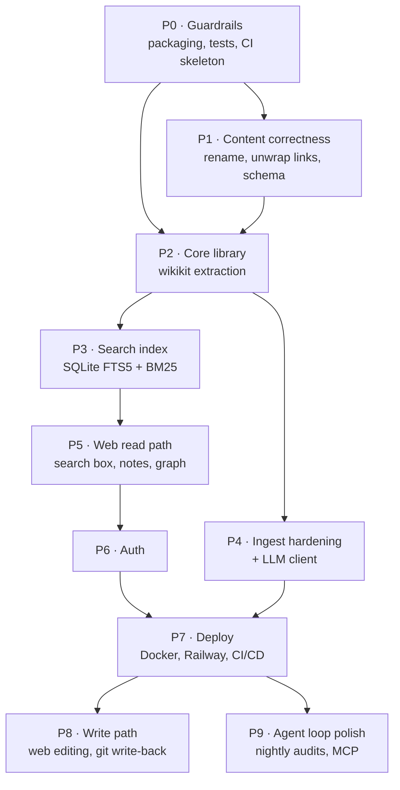

# 04 — Implementation Roadmap

**Status:** for review · **Depends on:** `docs/03-architecture.md`

Nine phases, ordered by dependency rather than by calendar. Each phase has an explicit **exit
criterion** — a command you can run or a thing you can click — so "done" is not a matter of opinion.

Deliberately **no day/week estimates**. What matters is which subsystems each phase touches, what it
unblocks, and how risky it is.

**Phase sizing** describes blast radius, not duration: `S` = one subsystem, additive ·
`M` = several modules, some rework · `L` = new subsystem or invasive refactor.

---

## Dependency graph

**Critical path to a deployed, private, searchable wiki:** P0 → P1 → P2 → P3 → P5 → P6 → P7.
P4, P8, and P9 are parallelisable or deferrable without blocking a first release.

---

## P0 — Guardrails before anything else · size `S`

You cannot safely refactor code that has no tests, and you cannot enforce quality with a linter that
always exits 0. This phase buys the right to touch everything else.

**Deliverables**

- `pyproject.toml`: packaging, `wiki` console entry point, pinned deps with a committed lockfile,
  configuration for ruff, mypy, and pytest.
- `tests/` skeleton with a fixture vault (a tiny wiki with deliberately broken content for rules to
  catch).
- `.github/workflows/ci.yml`: ruff, format check, mypy, pytest with coverage, on push and PR.
- `.pre-commit-config.yaml`: ruff, ruff-format, trailing whitespace, and a "no backticked wikilink"
  hook so F-01 can never come back through a commit.
- `LICENSE`, expanded `README.md`, `.editorconfig`.
- `docs/adr/0001-record-architecture-decisions.md`.

**Exit criterion** — `pip install -e ".[dev]" && pytest && ruff check . && mypy src` passes locally
and in CI on a pull request.

**Requirements:** FR-CLI-01, FR-OPS-02, FR-OPS-03, FR-OPS-12, NFR-MNT-03, NFR-MNT-07

---

## P1 — Content correctness: fix what you actually complained about · size `M`

The two visible problems (dead links, 14-digit filenames) are fixed here, and the generators that
create them are fixed *first* so the fix stays fixed.

**Deliverables**

- Rule-based linter with stable IDs, severities, `--json`, `--explain`, and a **non-zero exit code**
  (F-10, F-11). Initial rule set: W001 wikilink in inline code · W002 wikilink in code fence ·
  W003 broken target · W004 orphan atomic note · W005 missing frontmatter · W006 missing required key ·
  W007 invalid `type` · W008 unindexed source · W009 bloated zettel · W010 UID-prefixed filename ·
  W011 duplicate UID · W012 ambiguous link target · W020 missing link rationale · W021 literature note
  without `sources`.
- Every rule gets one passing and one failing fixture (NFR-MNT-01).
- `wiki fix` for the mechanically safe subset, with `--dry-run` diff output.
- `wiki migrate` implementing M1–M9 from `docs/03-architecture.md` §13.
- Fixed templates and generator strings (F-02) — before the content migration, not after.
- Frontmatter added to `index.md` and `log.md`; `uid` added to all 14 pages missing it.
- Migration executed as a **separate, reviewable commit** from the tooling that performs it.

**Exit criterion** — `wiki lint --strict` exits 0 with zero findings;
`python3 docs/evidence/audit_snapshot.py` drops from 66 findings to 0; the vault opens in Obsidian
with every link clickable and no filename starting with a number; that evidence script is then deleted.

**Requirements:** FR-CON-01…FR-CON-12, FR-LINT-01…FR-LINT-07 · **Fixes:** F-01…F-14

**Risk** — a bulk link rewrite can silently break links. Mitigation: `aliases` on every renamed note
(so even a missed reference resolves), plus a lint gate that must be green before the migration commit
is merged.

---

## P2 — Core library extraction · size `L`

Turn the 892-line script into an importable, typed library so the CLI, the web app, and future agents
share one implementation. This is the phase that makes the web app possible at all.

**Deliverables**

- `src/wikikit/` per the layout in `docs/03-architecture.md` §5: `models`, `notes`, `links`, `graph`,
  `lint`, `config`.
- Pydantic frontmatter models replacing regex YAML parsing (F-32); `pyyaml` finally earns its place in
  `requirements.txt` (F-29).
- Collision-safe, never-empty slug generation with unicode transliteration (F-07, F-08).
- Atomic writes (temp file, fsync, rename) so a crash cannot truncate a note (NFR-REL-04).
- Link resolution with the documented precedence order and explicit ambiguity errors (F-05, F-09).
- Graph builder with backlinks and metrics, linear in corpus size (F-14).
- Typer CLI with per-command `--help`, `--json`, meaningful exit codes, and no side effects on read
  commands (F-37).
- `tools/wiki.py` becomes a deprecation shim so `AGENTS.md` keeps working.
- Structured logging replacing `print()` (F-33).

**Exit criterion** — every command in the FR-CLI-06 table runs with `--help` and `--json`;
`git status --porcelain` is empty after `wiki lint`, `wiki search`, `wiki stats`, `wiki graph`;
coverage on the core package ≥ 80%.

**Requirements:** FR-CLI-01…FR-CLI-09, FR-GRAPH-01…FR-GRAPH-03, FR-GRAPH-07, NFR-MNT-01…NFR-MNT-05
· **Fixes:** F-25…F-37

**Risk** — the big-bang refactor. Mitigation: characterisation tests capturing current output *before*
moving code, then module-by-module migration with the shim keeping old invocations working.

---

## P3 — Search that earns the search box · size `M`

**Deliverables**

- SQLite FTS5 index with the schema from `docs/03-architecture.md` §6; heading-scoped chunking with
  anchors.
- One BM25 implementation replacing the three inconsistent copies (F-30, F-31).
- Snippet generation with term highlighting; prefix and typo tolerance for typeahead.
- Incremental indexing keyed on content hash plus mtime; `wiki reindex`; staleness reporting in
  `wiki doctor`.
- Filters: scope (`wiki`/`sources`/`all`), type, tag, date.
- Optional embeddings plus reciprocal rank fusion, degrading cleanly to lexical-only.
- Benchmark suite at 100/1,000/2,000 synthetic notes asserting the NFR-PERF-01/04/05 budgets.

**Exit criterion** — `wiki search "attentoin" --json` returns the attention notes with highlighted
snippets in under 150 ms at 2,000 notes; deleting the index file and re-running rebuilds it silently.

**Requirements:** FR-SRCH-01…FR-SRCH-09, NFR-PERF-01, NFR-PERF-04, NFR-PERF-05

---

## P4 — Ingest and LLM hardening · size `M` (parallelisable with P3/P5)

**Deliverables**

- One ingest contract (`fetch → validate → write raw + literature stub → log`) shared by all source
  kinds, so web and YouTube stop skipping the literature note (F-16).
- SSRF-safe fetcher: scheme allowlist, private/loopback/link-local blocking, redirect re-validation,
  size cap, timeouts (F-19, NFR-SEC-07).
- YouTube ingest rewritten against the installed `youtube-transcript-api` 1.x API, version-pinned,
  **failing loudly** instead of writing an error message as content (F-15).
- arXiv via HTTPS and a real XML parser with entity decoding (F-17).
- Content-hash idempotency, `--force`, and `--dry-run` (F-18).
- LLM client: config-driven models validated by `wiki doctor` against the live catalogue, retries with
  backoff and jitter, `Retry-After` support, total time budget, token and cost accounting
  (F-20, F-21, F-22).
- RAG assembly with an explicit token budget over chunks, plus citation verification (F-23).
- Prompt-injection containment: delimited untrusted context, data-not-instructions system framing,
  `status: draft` and `generated_by` on machine-authored pages (F-24).
- Recorded HTTP fixtures so the whole suite runs with no network and no API key (FR-LLM-10).

**Exit criterion** — the full test suite passes with `OPENROUTER_API_KEY` unset and no network;
ingesting a transcript-less video exits 3 and writes nothing; `http://169.254.169.254/` is refused.

**Requirements:** FR-ING-01…FR-ING-09, FR-LLM-01…FR-LLM-11 · **Fixes:** F-15…F-24

---

## P5 — Web read path: the Google-style window · size `L`

**Deliverables**

- FastAPI application factory, middleware (request ID, structured logs, security headers), templates,
  and error pages.
- Landing page: centred search field, corpus stats, hub links (FR-WEB-01).
- Search-as-you-type via HTMX with debounce, keyboard navigation (`/`, `↑↓`, `Enter`, `Esc`), and a
  no-JS fallback that posts to `/search`.
- Note renderer: markdown-it-py → **nh3-sanitised** HTML, wikilinks as real anchors, broken links
  visually marked, KaTeX for the existing `$$…$$` maths, Mermaid lazily loaded (FR-WEB-03).
- Backlinks panel with rationales, outbound links, metadata sidebar, source provenance, table of
  contents (FR-WEB-04).
- Local and global graph views (Cytoscape.js, lazy, node-capped with clustering fallback).
- Browse by type and tag, recently updated, breadcrumbs.
- Ask view with streamed answers and verified clickable citations.
- Admin health page rendering `wiki lint --json`.
- Path-traversal-safe slug resolution; XSS fixture tests; axe-core accessibility scan in CI.
- `wiki serve` for local development.

**Exit criterion** — locally, `wiki serve` yields a working search box that finds notes as you type,
notes that render with clickable wikilinks and correct maths, a graph you can click through, and
Playwright tests plus an axe scan passing in CI.

**Requirements:** FR-WEB-01…FR-WEB-09, FR-WEB-12…FR-WEB-15, FR-GRAPH-04…FR-GRAPH-06, FR-GRAPH-09,
NFR-UX-01…NFR-UX-08, NFR-PERF-02, NFR-PERF-03, NFR-PERF-09, NFR-SEC-06, NFR-SEC-09

**Risk** — scope creep in UI polish. Mitigation: the wireframes in `docs/03-architecture.md` §7 are the
contract; anything beyond them is a follow-up issue.

---

## P6 — Authentication · size `S`

Must land **before** the first public deploy, since P7 puts this on the internet.

**Deliverables**

- Login and logout, Argon2id verification against `ADMIN_PASSWORD_HASH`, signed session cookies with
  correct flags, server-side revocation.
- CSRF protection on every mutating route.
- Rate limiting with lockout and uniform error text.
- Route-coverage test that enumerates every registered route and asserts it is protected or explicitly
  allowlisted (NFR-SEC-01) — so a future route cannot accidentally ship public.
- `wiki auth hash-password`.
- `AuthBackend` interface with a single-owner implementation, leaving room for OAuth and multi-user
  without a rewrite.

**Exit criterion** — unauthenticated requests to `/`, `/wiki/*`, and `/api/*` redirect or 401; ten bad
logins trigger lockout; the route-coverage test passes.

**Requirements:** FR-AUTH-01…FR-AUTH-06, NFR-SEC-01…NFR-SEC-05, NFR-SEC-12, NFR-SEC-13

---

## P7 — Containerise, deploy, observe · size `M`

Full detail in `docs/05-cicd-and-railway-deployment.md`.

**Deliverables**

- Multi-stage `Dockerfile`: Tailwind build stage, non-root runtime, `PORT` respected, no shell wrapper.
- `railway.json` config-as-code: builder, Dockerfile path, watch patterns, health check path and
  timeout, restart policy, draining seconds (replica count and scale-to-zero are service settings, set
  once via the CLI).
- `/healthz` and `/readyz`, with the git SHA and build time exposed.
- Boot sequence: validate configuration (fail fast on missing variables), verify the wiki is readable,
  build the index, serve.
- `deploy.yml` triggered on merge to `main`, gated on CI, with health-check verification and rollback.
- Post-deploy smoke tests: login page renders, search API answers, one note renders, security headers
  present.
- Secret scanning and `pip-audit` in CI; documented Railway variables.
- Structured JSON logs; optional Sentry behind a DSN variable.

**Exit criterion** — merging to `main` produces a live, private, HTTPS wiki you log into from your
phone; a deliberately broken deploy is rejected and the previous release keeps serving.

**Requirements:** FR-OPS-03…FR-OPS-08, NFR-POR-01…NFR-POR-03, NFR-REL-01…NFR-REL-06, NFR-OBS-01…NFR-OBS-05,
NFR-COST-01…NFR-COST-04

---

## P8 — Write path from the browser · size `M`

**Deliverables**

- Create and edit notes in the browser: markdown editor, live preview, wikilink autocomplete, commit
  message field.
- Git write-back through the GitHub API with a scoped token, so edits survive redeploys by construction
  (option B in `docs/03-architecture.md` §10).
- Ingest-from-browser with a background job queue and progress reporting.
- Broken-link "create this note" flow, pre-filled from the referring context.
- "File this answer into the wiki" action, recording the question and cited sources as provenance.
- Optimistic-concurrency conflict handling when the same note changed upstream.

**Exit criterion** — an edit made in the deployed app appears as a commit in GitHub, survives a
redeploy, and shows up in the rebuilt search index.

**Requirements:** FR-WEB-08, FR-WEB-10, FR-WEB-11, FR-GRAPH-05, FR-OPS-09, NFR-DAT-01

---

## P9 — Close the agent loop · size `S`

**Deliverables**

- Nightly workflow running `wiki lint` and `wiki ai-lint`, opening an issue or PR with findings,
  contradictions, and suggested next sources (FR-OPS-10).
- `wiki index --rebuild` generating `wiki/index.md` from frontmatter so the catalogue stops being
  hand-maintained.
- Auto-link review queue: embedding-similarity suggestions you accept or reject, never auto-applied.
- MCP server exposing search, read, create, link, and lint so Cursor and Claude Code drive the wiki as
  native tools (FR-CLI-10).
- `AGENTS.md` refreshed to the real command surface, with the CI check that keeps it honest
  (FR-OPS-13).
- `wiki export` for Obsidian/JSON/zip.

**Exit criterion** — a night passes and you wake up to a report telling you what is contradictory,
orphaned, or missing from your wiki, without having asked.

**Requirements:** FR-CON-12, FR-GRAPH-08, FR-LINT-08, FR-OPS-10, FR-OPS-13, FR-CLI-10

---

## Smallest useful slice

If you want value before the whole plan lands, **P0 + P1 alone** fixes every complaint in your
message except the web app: readable filenames, working links, and a linter that actually enforces the
rules. It touches no infrastructure and is a small, reviewable diff.

Then **P2 + P3 + P5 + P6 + P7** gets the deployed, private, searchable, graph-linked web wiki.

---

## Risk register

| Risk | Impact | Likelihood | Mitigation |
| --- | --- | --- | --- |
| Bulk link rewrite in P1 silently breaks references | High | Medium | `aliases` on every rename, lint gate before merge, migration in its own commit |
| P2 refactor introduces regressions in working ingest code | High | Medium | Characterisation tests first, module-by-module migration, shim keeps old entry points alive |
| Ephemeral Railway filesystem loses web-authored content | **Critical** | High if unaddressed | Read-mostly v1; git write-back in P8; never treat container disk as authoritative |
| OpenRouter free-tier models disappear or rate-limit | Medium | High | Config-driven models, `wiki doctor` validation, backoff, graceful degradation to non-LLM features |
| Prompt injection via ingested pages corrupts the wiki | Medium | Medium | Delimited untrusted context, `status: draft`, human promotion, injection fixture tests |
| The deployment is accidentally public | High | Low | Route-coverage test enumerating every route (NFR-SEC-01) |
| Search quality disappoints and the box goes unused | Medium | Medium | Hybrid retrieval, typo tolerance, zero-result query logging to find gaps |
| Scope creep in UI polish delays deployment | Medium | High | Wireframes are the contract; deploy at P7 and iterate |
| Graph view unusable as the corpus grows | Low | Medium | Node cap with clustering, local-graph default, type filters |
| Cost creep from LLM calls | Low | Medium | Free-tier defaults, per-call accounting, configurable monthly cap |

---

## Definition of done for v1

1. `wiki lint --strict` exits 0 on the real wiki, in CI, on every pull request.
2. No filename under `wiki/` begins with a digit; every wikilink in the vault resolves.
3. A private HTTPS wiki on Railway, reachable from your phone, behind a login.
4. Search-as-you-type returns useful results from the third keystroke.
5. Every note shows computed backlinks with rationales and a working local graph.
6. `wiki ingest <url>` adds a source, its literature note, and a log entry in one command.
7. `wiki ask "<question>"` answers with citations that resolve to real notes.
8. Merging to `main` deploys automatically; a failing health check rolls back.
9. Core-library coverage ≥ 80%, and every bug in `docs/00-audit-findings.md` has a regression test.
10. The wiki still opens in Obsidian as a plain vault, with graph view and Dataview intact.

Next: `docs/05-cicd-and-railway-deployment.md`.
