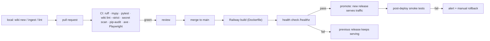

# 05 — CI/CD and Railway Deployment

**Status:** for review · **Depends on:** `docs/04-implementation-roadmap.md` (phase P7)

Railway specifics below were checked against the Railway CLI reference material bundled with this
environment (builder options, service-config paths, provided variables, deployment verification rules)
rather than written from memory. Where the CLI and this document ever disagree, trust the CLI.

---

## 1. Pipeline overview



Two rules govern the whole pipeline:

1. **Nothing reaches `main` that fails `wiki lint --strict`.** The content quality gate is a build
   gate. This is only possible because P1 makes lint exit non-zero (F-10).
2. **Nothing serves traffic that fails its health check.** A broken deploy leaves the previous release
   running.

---

## 2. Continuous integration

### `ci.yml` — every push and pull request

| Job | Steps | Gate |
| --- | --- | --- |
| `quality` | `ruff check`, `ruff format --check`, `mypy src` | fail on any error |
| `test` | `pytest -q --cov` on Python 3.11 and 3.12 | fail under the coverage threshold (NFR-MNT-01) |
| `wiki` | `wiki lint --strict --json`, rendered as PR annotations | fail on any error-severity finding |
| `security` | `gitleaks` secret scan, `pip-audit` | fail on a leaked secret or a high/critical CVE |
| `web` | build Tailwind, run Playwright end-to-end tests, run an axe-core accessibility scan | fail on a broken flow or a critical a11y violation |
| `perf` | benchmark search and lint against a generated 2,000-note corpus | fail if a NFR-PERF budget regresses |
| `docker` | build the image (no push) and boot it with a smoke request against `/healthz` | fail if the image cannot serve |

Caching for pip/uv and Docker layers keeps the whole pipeline inside NFR-COST-04's five-minute budget.

The `wiki` job is the one that makes this project unusual and is worth stating plainly: **content is
tested like code**. Add a note with a backticked wikilink, or a zettel with no MOC linking to it, and
the pull request goes red. That is the mechanism that stops the 66 findings from ever accumulating
again.

### `nightly.yml` — scheduled

- `wiki lint --json` and `wiki ai-lint` over the whole wiki.
- Opens or updates a single issue titled "Wiki health report" with broken links, orphans, stale claims,
  contradictions, and suggested next sources (FR-OPS-10).
- Uploads a JSON report artifact and a `wiki export` archive as an off-platform backup (NFR-REL-08).
- Tolerates LLM failure: the advisory audit never fails the workflow (FR-LINT-08).

### `deploy.yml` — on merge to `main`

Gated on `ci.yml` succeeding, then:

```bash
railway up --ci --service wiki --environment production -m "$GITHUB_SHA"
railway deployment list --service wiki --json     # poll until status is SUCCESS
```

`--ci` streams build logs and its exit code is authoritative. A detached `up` only tells you the build
was *queued*, so the workflow polls `railway deployment list --json` until the newest deployment
reaches `SUCCESS`, and treats `FAILED`/`CRASHED` as a pipeline failure that pulls logs automatically.

Authentication is unattended via a `RAILWAY_TOKEN` (project-scoped, preferred) or `RAILWAY_API_TOKEN`
(account-scoped) GitHub secret.

**Alternative worth considering:** Railway can watch the GitHub repo directly and deploy on push with
no workflow at all. That is simpler, but it deploys *before* CI has an opinion. The recommendation is
GitHub Actions as the gatekeeper precisely so `wiki lint --strict` can block a bad release.

### `preview.yml` — pull requests touching the web app

Railway supports ephemeral PR environments (`railway environment list --ephemeral`). Enable them for
front-end changes so UI review happens on a real URL rather than in your imagination (FR-OPS-11).
Preview environments get their own variables and must never share the production session secret.

---

## 3. Container image

Multi-stage, non-root, no shell wrapper:

```dockerfile
# ---- stage 1: front-end assets ----
FROM node:22-slim AS assets
WORKDIR /app
COPY package.json package-lock.json tailwind.config.js ./
RUN npm ci
COPY web/ ./web/
RUN npm run build:css          # -> web/static/app.css

# ---- stage 2: python deps ----
FROM python:3.12-slim AS deps
ENV PIP_NO_CACHE_DIR=1 PYTHONDONTWRITEBYTECODE=1
WORKDIR /app
COPY pyproject.toml uv.lock ./
RUN pip install uv && uv sync --frozen --no-dev

# ---- stage 3: runtime ----
FROM python:3.12-slim
ENV PYTHONUNBUFFERED=1 PYTHONDONTWRITEBYTECODE=1 WIKI_INDEX_PATH=/tmp/wiki-index.db
RUN useradd --create-home --uid 10001 wiki
WORKDIR /app
COPY --from=deps /app/.venv /app/.venv
ENV PATH="/app/.venv/bin:$PATH"
COPY --chown=wiki:wiki . .
COPY --from=assets --chown=wiki:wiki /app/web/static/app.css web/static/app.css
USER wiki
EXPOSE 8000
# Railway injects PORT; default for local docker runs.
CMD ["sh", "-c", "exec uvicorn web.app:app --host 0.0.0.0 --port ${PORT:-8000}"]
```

Notes that matter:

- **`PORT` must be respected.** Railway injects it; hardcoding 8000 is the classic "deploy succeeds,
  domain 502s" mistake.
- **Non-root with UID 10001** (NFR-SEC-11). The search index goes in `/tmp`, the one path that is
  writable without a volume.
- **`.dockerignore`** excludes `.git`, `docs/`, `tests/`, and caches to keep the image small and the
  build fast.
- **Builder choice:** Railway's default builder is Railpack, which would auto-detect Python and mostly
  work. We choose `DOCKERFILE` explicitly because we need a Node stage for Tailwind and want the exact
  same image locally and in production (NFR-POR-01).

### Boot sequence

```
1. Load and validate configuration; exit non-zero with a precise message if a required variable is missing.
2. Verify the wiki content directory is readable.
3. Build or load the search index (rebuild at boot; it is derived and disposable).
4. Report ready on /readyz; start serving.
```

Fail-fast validation at step 1 is what prevents the other classic Railway experience: a green deploy
that returns 500 on every request because one variable was never set (NFR-POR-03).

---

## 4. Railway service configuration

Railway reads a `railway.json` (or `railway.toml`) from the repo and merges it over the dashboard
settings, with config-as-code winning. Keeping it in the repo means the deployment shape is reviewable in
a pull request instead of living as undocumented dashboard state.

```json
{
  "$schema": "https://railway.com/railway.schema.json",
  "build": {
    "builder": "DOCKERFILE",
    "dockerfilePath": "Dockerfile",
    "watchPatterns": ["src/**", "web/**", "wiki/**", "sources/**", "pyproject.toml", "Dockerfile"]
  },
  "deploy": {
    "healthcheckPath": "/healthz",
    "healthcheckTimeout": 120,
    "restartPolicyType": "ON_FAILURE",
    "restartPolicyMaxRetries": 3,
    "drainingSeconds": 10
  },
  "environments": {
    "pr": {
      "deploy": { "healthcheckTimeout": 60 }
    }
  }
}
```

| Setting | Value | Why |
| --- | --- | --- |
| `build.builder` | `DOCKERFILE` | Reproducible image including the Tailwind stage. (Railway builds with a Dockerfile whenever it finds one, so this is belt-and-braces.) |
| `build.watchPatterns` | source, web, and content paths | Avoids rebuilding for a docs-only commit |
| `deploy.healthcheckPath` | `/healthz` | Gates promotion of a new release (FR-OPS-05) |
| `deploy.healthcheckTimeout` | `120` | Comfortably covers boot plus index build (NFR-PERF-06) |
| `deploy.restartPolicyType` | `ON_FAILURE` | Restart on crash, do not loop forever |
| `deploy.restartPolicyMaxRetries` | `3` | Surface persistent failures instead of hiding them |
| `deploy.drainingSeconds` | `10` | Graceful shutdown between SIGTERM and SIGKILL |
| `environments.pr` | reduced timeout | Config-as-code has a dedicated block for ephemeral PR environments — handy for FR-OPS-11 |

Two settings we want are **service settings rather than config-as-code fields**, so they are set once via
the CLI or dashboard:

```bash
railway environment edit --service-config wiki deploy.numReplicas 1
railway environment edit --service-config wiki deploy.sleepApplication true
```

- `numReplicas: 1` — a single reader does not need two (NFR-COST-01).
- `sleepApplication: true` — scale to zero when idle, the main lever for NFR-COST-02.

**On scale-to-zero:** it saves real money but adds a cold start to the first request after idle. With a
5-second boot budget (NFR-PERF-06) that is an acceptable trade for a personal wiki. If the first search
of the morning feeling sluggish annoys you, turn it off and pay for an always-on instance.

**Cron, for later:** `deploy.cronSchedule` lets a service run on a schedule. That is an alternative home
for the P9 nightly audit if you would rather it run on Railway than in GitHub Actions — though Actions is
free and already has the repo checked out, so it stays the recommendation.

---

## 5. Configuration and secrets

| Variable | Required | Purpose | Secret? |
| --- | --- | --- | --- |
| `PORT` | injected | Listen port | no |
| `WIKI_CONTENT_DIR` | yes | Path to the wiki content (default `./wiki`) | no |
| `WIKI_INDEX_PATH` | yes | Search index location (`/tmp/wiki-index.db`) | no |
| `SESSION_SECRET` | yes | Cookie signing key, ≥ 32 random bytes | **sealed** |
| `ADMIN_USERNAME` | yes | Owner login | no |
| `ADMIN_PASSWORD_HASH` | yes | Argon2id hash from `wiki auth hash-password` | **sealed** |
| `OPENROUTER_API_KEY` | no | LLM features; absent means they degrade gracefully | **sealed** |
| `OPENROUTER_MODEL` | no | Primary model slug | no |
| `OPENROUTER_FALLBACK_MODELS` | no | Comma-separated fallbacks | no |
| `LLM_MONTHLY_BUDGET_USD` | no | Hard spend cap (NFR-COST-03) | no |
| `EMBEDDING_MODEL` | no | Enables semantic search when set | no |
| `GITHUB_TOKEN` / `WIKI_REPO` | P8 only | Git write-back for browser edits | **sealed** |
| `SENTRY_DSN` | no | Error reporting | **sealed** |
| `LOG_LEVEL` | no | Default `INFO` | no |
| `RAILWAY_GIT_COMMIT_SHA` | injected | Surfaced at `/healthz` for deploy traceability (NFR-OBS-05) | no |

Railway **sealed variables are write-only** — their values never appear in CLI or dashboard output.
Use sealed for every secret above. Set them via stdin so they never enter shell history:

```bash
printf "%s" "$SESSION_SECRET" | railway variable set SESSION_SECRET --stdin --service wiki
```

`.env` stays git-ignored (already true), `.env.example` documents every variable with safe defaults,
and `wiki doctor` validates the whole set locally before you ever deploy.

---

## 6. Persistence: the decision that actually matters

**Railway container filesystems are ephemeral.** Every redeploy replaces the container. Anything the
app wrote to local disk is gone.

| Data | Where it lives | Survives redeploy? |
| --- | --- | --- |
| Wiki markdown | Git repo, baked into the image at build time | yes — git is the source of truth |
| Search index | `/tmp`, rebuilt at boot | not needed — derived and disposable (NFR-REL-05) |
| Sessions | In-process, plus signed cookies | sessions end at redeploy; acceptable for one owner |
| Web-authored edits (P8) | Committed to GitHub via API | yes — by construction |
| LLM usage ledger | Committed with content, or exported nightly | yes |

**Therefore v1 needs no volume and no database**, which is what keeps the bill near the NFR-COST-01
target. If you later want the app to write directly to disk (a Railway volume mounted at
`RAILWAY_VOLUME_MOUNT_PATH`), that becomes a second copy of your knowledge that can drift from git — a
worse problem than the one it solves. The git write-back path in P8 avoids it entirely.

---

## 7. Health checks and observability

```json
GET /healthz  →  {"status":"ok","sha":"<RAILWAY_GIT_COMMIT_SHA>","built":"<iso8601>","version":"1.0.0"}
GET /readyz   →  {"status":"ready","notes":21,"index_age_s":12,"wiki_readable":true}
```

Both are unauthenticated, cheap, and fast (NFR-OBS-02). `/healthz` answers "is the process alive" for
Railway's promotion gate; `/readyz` answers "can it actually serve" and is what the post-deploy smoke
test asserts.

Logging is structured JSON to stdout — Railway collects it, and `railway logs --service wiki --lines
200 --json` is then greppable. Every line carries a request ID; no line carries a secret or a full note
body (NFR-OBS-01, NFR-SEC-13).

### Post-deploy smoke test

Runs against the real public domain after every deploy and fails the workflow if any assertion fails:

1. `/healthz` returns 200 and the SHA matches `GITHUB_SHA` — proving the new build is actually serving.
2. `/` unauthenticated redirects to `/login` — proving the wiki is not public.
3. Log in with test credentials, then `/api/search?q=attention` returns results.
4. `/wiki/scaled-dot-product-attention` renders with a resolved wikilink present in the HTML.
5. Security headers present: HSTS, CSP, `X-Content-Type-Options`, `Referrer-Policy`.

Point 4 is deliberate: it is a live, continuous regression test for the exact bug you reported.

---

## 8. Rollback

| Situation | Response |
| --- | --- |
| Health check fails during deploy | Railway does not promote; the previous release keeps serving (FR-OPS-05) |
| Smoke test fails after promotion | `railway redeploy --service wiki --yes` against the last good deployment, or `railway down` to drop the latest |
| Bad content merged (broken links reach `main`) | Revert the commit; deploy follows automatically. CI should have caught it — if it did not, add the missing lint rule with a regression fixture |
| Secret compromised | Rotate the sealed variable; the change triggers a redeploy and invalidates sessions |

Rehearse this once during P7 with a deliberately broken deploy (NFR-REL-02). A rollback path you have
never exercised is a rollback path you do not have.

---

## 9. Cost model

| Item | Expected |
| --- | --- |
| Railway compute, 1 replica with scale-to-zero | roughly $1–3/month at personal usage |
| Railway database | $0 — none used |
| Railway volume | $0 — none used |
| GitHub Actions | $0 on the free tier at a five-minute pipeline |
| OpenRouter | $0 with free-tier models; capped by `LLM_MONTHLY_BUDGET_USD` |
| Custom domain | your registrar's price; Railway TLS is included |

Comfortably inside the ≤ $5/month target. The two things that would break it are adding a managed
Postgres for a single-row users table, and turning off scale-to-zero — which is exactly why the
architecture avoids the first and makes the second a conscious choice.

---

## 10. Pre-launch checklist

- [ ] `wiki lint --strict` green in CI on `main`
- [ ] All sealed variables set in the production environment
- [ ] `ADMIN_PASSWORD_HASH` generated by `wiki auth hash-password`, password stored in a password manager
- [ ] `SESSION_SECRET` is ≥ 32 random bytes, unique to production
- [ ] Route-coverage test proves no unintended public route (NFR-SEC-01)
- [ ] Health check path configured and returning the deployed SHA
- [ ] Smoke tests wired into `deploy.yml` and passing
- [ ] Rollback rehearsed with a deliberately broken deploy
- [ ] Nightly export artifact confirmed downloadable (backup independent of the platform)
- [ ] Secret scan and `pip-audit` clean
- [ ] CSP, HSTS, and sanitisation verified with the XSS fixture corpus
- [ ] SSRF blocklist verified against metadata and loopback addresses
- [ ] Custom domain and TLS confirmed
- [ ] Logged in successfully from a phone on mobile data

Next: `docs/06-open-decisions.md`.
