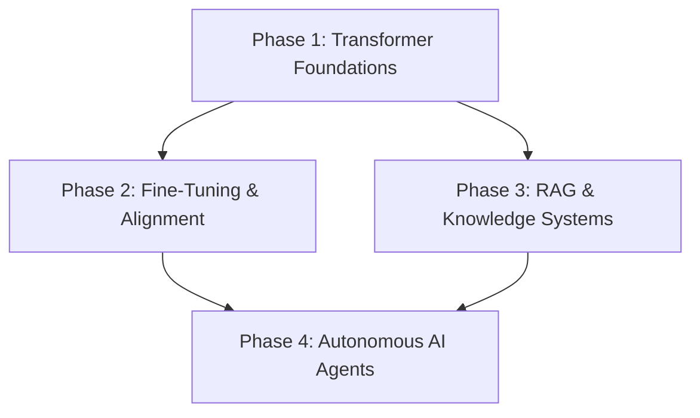

# AI Learning Roadmap 2026

A structured curriculum and learning pathway for mastering modern Artificial Intelligence, Machine Learning, and LLM Application Engineering based on synthesized knowledge across this wiki.

---

## Phase 1: Foundations (Core Architecture & Math)
1. **Transformer Deep Dive**: Understand Query, Key, Value mechanics, Multi-Head Attention, and positional embeddings.
   - Core Page: [[transformer-architecture]]
   - Landmark Paper: [[Attention Is All You Need|Attention Is All You Need]]
2. **PyTorch & Model Weights**: Learn tensor operations, forward/backward passes, and loading weights via [[hugging-face]].

---

## Phase 2: Adaptation & Optimization
1. **Fine-Tuning Techniques**: Learn Parameter-Efficient Fine-Tuning (PEFT), LoRA, and 4-bit QLoRA quantizations.
   - Core Page: [[fine-tuning-and-alignment]]
2. **Alignment Methods**: Direct Preference Optimization (DPO) and RLHF.

---

## Phase 3: Systems & Data Integration
1. **RAG Architectures**: Implement chunking, vector embeddings, hybrid BM25 + dense search, and reranking.
   - Core Page: [[retrieval-augmented-generation]]
2. **Knowledge Base Patterns**: Compare traditional vector RAG against structured, compounding the project conventions architectures.

---

## Phase 4: Autonomous Agents & Product Engineering
1. **Agent Workflows**: Implement ReAct loops, prompt chaining, tool calling, and evaluator-optimizer feedback loops.
   - Core Page: [[ai-agents-and-tools]]
   - Industry Standard: [[Building Effective Agents|Building Effective Agents]]
2. **Ecosystem & Frontier Models**: Track state-of-the-art models across [[openai]], [[anthropic]], and open-weights releases from [[meta-ai]].

---

## Synthesis Graph

