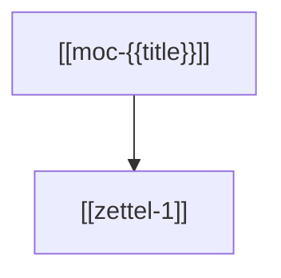

# Map of Content: {{title}}

This **Map of Content (MOC)** aggregates all atomic Zettel notes, foundational concept overviews, and literature summaries related to {{title}}.

---

## 1. Atomic Zettels (`wiki/atomic/`)
- `[[zettel-1]]` — Brief rationale.

## 2. Concept Overviews
- `[[concept-1]]` — High-level topic description.

---

## Graph Diagram

