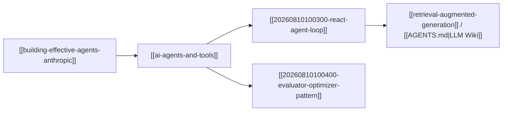

# Map of Content: Agentic Systems & Workflows

This **Map of Content (MOC)** aggregates all atomic Zettel notes, system concept pages, and engineering guides related to autonomous AI agents, tool integration, and control loop patterns.

---

## 1. Core Agentic Patterns (Atomic Zettels)
- `[[20260810100300-react-agent-loop]]` — Interleaved Thought-Action-Observation environment control loop.
- `[[20260810100400-evaluator-optimizer-pattern]]` — Generator-Critic feedback loop for iterative output critique and refinement.

## 2. High-Level Concept Overviews
- [[ai-agents-and-tools]] — ReAct loops, tool registries, short-term vs long-term memory, multi-agent coordination.
- [[retrieval-augmented-generation]] — Knowledge retrieval paradigms (vector RAG vs persistent [[AGENTS.md|LLM Wiki]]).

## 3. Structural Overviews & Guides
- [[building-effective-agents-anthropic]] — Anthropic's authoritative guide on composable agent workflows vs autonomous loops.
- [[state-of-ai-engineering]] — Comparative analysis of agent frameworks and frontier model capabilities.

## 4. Key Entities
- [[anthropic]] — Creator of Claude 3.5 Sonnet & Model Context Protocol (MCP).
- [[openai]] — Creator of GPT-4o & Function Calling standards.

---

## Agent Architecture Map

