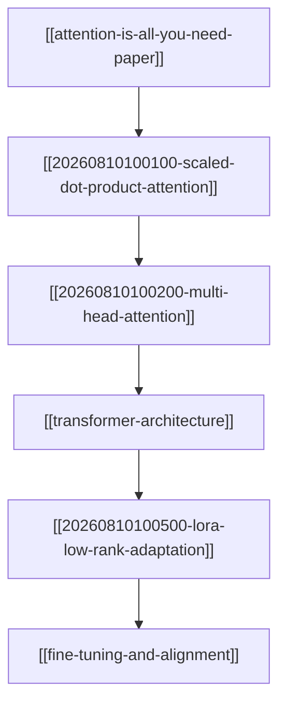

# Map of Content: LLM Architectures & Mechanics

This **Map of Content (MOC)** aggregates all atomic Zettel notes, foundational concept overviews, and landmark papers related to neural network architectures, attention mechanisms, and model adaptations.

---

## 1. Core Attention Mechanisms (Atomic Zettels)
- `[[20260810100100-scaled-dot-product-attention]]` — Q/K/V pairwise similarity computation and $\frac{1}{\sqrt{d_k}}$ scaling factor.
- `[[20260810100200-multi-head-attention]]` — Parallel linear projections across distinct representation subspaces.

## 2. High-Level Concept Overviews
- [[transformer-architecture]] — Encoder-decoder, decoder-only, and positional encoding paradigms.
- [[fine-tuning-and-alignment]] — SFT, LoRA/QLoRA PEFT adaptation, RLHF, and DPO alignment.

## 3. Parameter-Efficient Adaptation (Atomic Zettels)
- `[[20260810100500-lora-low-rank-adaptation]]` — Low-Rank matrix decomposition ($W_0 + BA$) for memory-efficient tuning.

## 4. Key Entities & Landmark Papers
- [[attention-is-all-you-need-paper]] — Landmark 2017 paper by Vaswani et al. introducing Transformers.
- [[openai]] — Pioneer of decoder-only GPT architecture.
- [[meta-ai]] — Creators of LLaMA open-weights family & PyTorch.
- [[hugging-face]] — Ecosystem host for `transformers` and `peft` libraries.

---

## Architectural Dependency Graph

